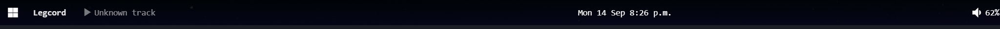

# my-bar

A widget pack for [zebar](https://github.com/glzr-io/zebar) on Windows. It puts one 42 pixel strip at the top of the screen, and the strip opens panels for media, system, storage, weather, battery, calendar, and window actions.



## What the bar does

The bar is one widget. Each part of it opens a panel widget:

| Part of the bar | Opens | Panel shows |
| --- | --- | --- |
| App mark (left) | `windows-menu` | Task manager, Settings, and the power actions |
| Foreground window name | `windows-menu` | The same menu |
| Now playing tile | `media-panel` | Track, artist, album, and transport buttons |
| Clock | `calendar-panel` | Month grid, agenda, and a search box |
| System tile | `system-panel` | CPU load and RAM use |
| Storage tile | `storage-panel` | Free space for each drive |
| Battery tile | `battery-panel` | Charge and time remaining |
| Weather tile | `weather-panel` | Temperature and the 5 day forecast |
| Volume tile | `controls-panel` | Volume and screen brightness |

One click closes a panel that is open. A click outside a panel closes it too.

The bar docks to the top edge, so maximized windows stop below it. If no window is maximized, the bar floats 6 pixels from the edge with 9 pixel corners.

## Shortcuts and gestures

**Volume and brightness.** You can change the volume and brightness straight from the volume tile on the bar:
- **Scroll** over the tile to raise or lower the volume by 2%.
- **Shift + scroll** over the tile to change the screen brightness by 5%.
- **Click and drag** left or right on the tile to scrub volume continuously.
- **Shift + drag** on the tile to scrub screen brightness.

**Now playing tile.** The media tile shows the current track and artist. When playback stops, the tile dims and remembers the last track rather than vanishing.

**Calendar panel.** While the calendar panel is open:
- `Ctrl+F` focuses the event search box.
- `R` reloads the calendar feeds.
- `Esc` closes event details or dismisses the panel.
- A banner appears at the top of the day view when an event starts in less than 15 minutes.

## Requirements

- Windows 10 or Windows 11.
- Zebar 3.x.
- PowerShell 5.1 or later. Windows supplies it.
- No API key. The weather panel reads open-meteo.com, and the calendar panel reads the feeds that you list.

## Install

1. Copy this folder to `%USERPROFILE%\.glzr\zebar\my-bar`.
2. Add the pack to `startupConfigs` in `%USERPROFILE%\.glzr\zebar\settings.json`:

```json
{
  "startupConfigs": [
    {
      "pack": "my-bar",
      "widget": "vanilla",
      "preset": "default"
    }
  ]
}
```

3. In the Zebar tray icon, click `Empty cache and reload configs`.

Note: the pack `name` field in `zpack.json` must stay `my-bar`. The value in `startupConfigs.pack` refers to this field, not to the folder name.

## Configuration

**Calendar feeds.** Make a file `%USERPROFILE%\.glzr\calendar-feeds.txt`. Put one iCalendar URL on each line. A line that starts with `#` is a comment. The panel reads this file at each refresh.

**Weather location.** The weather panel asks ipinfo.io for an approximate location, then asks open-meteo for the forecast. To use a fixed location, set the coordinates in the provider group in `weather-panel.html`.

**Brightness.** `scripts/brightness.ps1` changes the brightness of the built in panel through the WMI monitor classes. External monitors usually ignore this command.

**Private changes.** A file that ends in `.local` is yours. Git ignores these files.

## How it works

The pack has no build step. Each widget is a plain HTML page with an inline CSS link to `styles.css`. Zebar gives the pages live data through providers.

Two parts of the operating system have no provider, so the pack reads them with PowerShell helpers in `scripts/`:

- `window-ctl.ps1` tracks the panel windows and closes a panel when a click lands outside it.
- `brightness.ps1`, `power.ps1`, `specs.ps1`, and `calendar.ps1` do the tasks that a web page cannot do alone.

`zpack.json` gives each helper an exact `shellCommands` rule, so the pack asks for three commands and no more.

## Layout

```
vanilla.html            the bar strip
*-panel.html            one page per panel
styles.css              all styles for the bar and the panels
assets/                 icons, weather and calendar readers, vendored libraries
scripts/                PowerShell helpers
resources/              preview image
zpack.json              widget and preset definitions
```

## Reference project

This pack started as a copy of the starter pack that ships with [zebar](https://github.com/glzr-io/zebar) (`glzr-io.starter`), by the zebar authors. The starter pack gives a buildless bar, a widget schema, and a reload model. This pack keeps that base and adds:

- Panel widgets for media, system, storage, weather, battery, calendar, and window actions.
- A PowerShell guard that closes a panel on a click outside its rectangle.
- A window size that follows the card inside it, so a panel has no dead strip.
- A docked top edge that shrinks the work area, so maximized windows stop below the bar.

The vendored files in `assets/vendor/` come from zebar and its dependencies. See the licenses of those projects.

## Limitations

- Windows only. `dockToEdge` does nothing on Linux and macOS, and the brightness helper uses WMI.
- The bar is one widget, so a broken provider can hide its tile until the next reload.
- Zebar holds port `127.0.0.1:6124`. Start one instance only.
- The pack is personal. The panel sizes and the offsets fit a 2880 x 1800 screen.

## License

GPL-3.0. See `LICENSE`. This pack is a derivative of the zebar starter pack, which zebar publishes under GPL-3.0.
